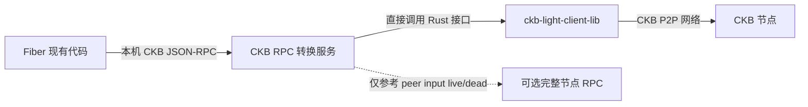
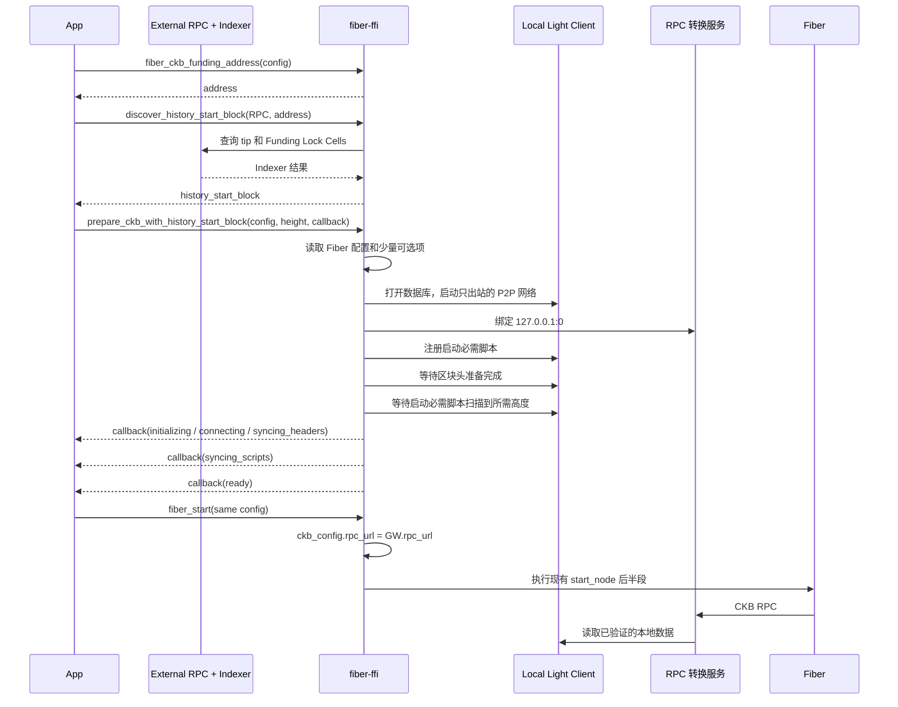

# Fiber FFI 内置 CKB Light Client 方案

> 状态：实现中
>
> 目标仓库：`fiber-ffi`
>
> 约束：第一版优先不修改 Fiber 和 `ckb-light-client` 的源码

## 1. 方案概述

先说结论：**CKB Light Client 自带的 RPC 不能原样覆盖 Fiber 现在使用的全部 CKB RPC，但 Fiber 当前使用的请求可以由 Light Client 和本地转换服务完成。**在“不修改 Fiber”的前提下，下列请求需要特别处理：

- `get_epoch_by_number`：Fiber 使用的 CKB SDK 会在计算 cellbase 成熟高度时间接调用。目标 epoch 有本地已证明区块头时返回精确 epoch；否则只为 SDK 当前查询的成熟 epoch 返回一个保守的、本地可证明的成熟高度。
- `get_live_cell`：先通过 Light Client 取得并验证产生 Cell 的交易。已跟踪脚本继续由 Light Client 的 UTXO 索引判断；对端临时加入且本地未跟踪的 funding input，可以显式配置同链全节点 RPC，只参考其 live/dead 状态，忽略其返回的 Cell 内容。
- `send_transaction`：由 Light Client 在本地准备依赖、确认输入仍为 live、完成交易验证并放入待广播队列。返回成功不表示某个完整节点已经接收进交易池，也不表示交易已上链。

开启内置 Light Client 后，所有 Fiber CKB RPC 仍由本地网关处理，不做通用的错误转发。唯一可配置的外部请求是未跟踪的对端 funding input 存活状态；链上内容、CellDep、交易验证、广播和最终确认仍由 Light Client 负责。无法可靠回答的其他请求返回明确的 `not-ready` 或 `unsupported` 错误。

在 `fiber-ffi` 中增加 Cargo 功能开关，用它决定从哪里读取 CKB 链上数据：

- 未开启 Light Client 功能：保持现有行为。Fiber 通过 `CkbConfig.rpc_url` 访问外部 CKB 全节点 RPC。
- 开启 `disable-ckb-rpc`：启动内置 Light Client 和本地 RPC 转换服务。

开启 `disable-ckb-rpc` 时，`fiber-ffi` 将：

1. 在当前进程中启动 `ckb-light-client-lib`。
2. 在 `127.0.0.1` 的随机端口启动一个本地 CKB JSON-RPC 转换服务。
3. 转换服务主要调用 Light Client 的内部服务和本地存储接口；配置后，仅为未跟踪的对端 funding input 向同链完整节点查询 `get_live_cell(..., false)`。
4. 在内存中把 `CkbConfig.rpc_url` 改为本地转换服务的地址。
5. 按现有流程启动 Fiber，Fiber 本身无需修改。



这个转换服务不会把未验证数据伪装成链上事实。它只把 Light Client 已经验证过的链上数据转换成 Fiber 现在使用的 CKB 全节点 RPC 格式。`get_epoch_by_number` 的保守结果只用于 CKB SDK 的成熟高度计算，并且不会让未被本地证明为成熟的 Cell 进入候选集；不得伪造 `Consensus` 或脚本扫描进度。

内置 Light Client 的核心目的只有一个：为当前进程中的 Fiber 提供必需的 CKB 链上数据、交易验证和交易广播。它不是一个通用的 CKB Light Client，也不向其他程序提供服务。

只有满足下列条件之一的功能才允许启用：

- Fiber 当前确实会调用。
- 为了取得、验证或广播 Fiber 所需的数据而必须启用。
- 为了保存同步结果、恢复运行或排查错误而必须保留。

不满足这些条件的 RPC、网络监听、网络协议和后台任务全部关闭。以后如果 Fiber 增加了新的需要，再根据 Fiber 源码和测试逐项开启，不能直接照搬 `light-client-bin` 的完整运行方式。

## 2. 这一版要做什么

本节说明第一版必须做到哪些事，以及运行时明确不启用哪些功能。

### 2.1 第一版必须做到

- 不修改 Fiber 源码，实现 Fiber 目前会用到的 CKB RPC 方法。
- 保持原有 `fiber_start` 兼容，并增加独立的钱包历史发现 API 和稳定的异步 `fiber_prepare_ckb` C API。用 Cargo 功能开关选择数据来源。普通的主网和测试网运行不要求用户填写 Light Client 配置。
- 不传 `disable-ckb-rpc` 时，编译结果和现有的外部 RPC 行为保持不变。
- Light Client 遇到无法处理的请求时，不得因为失败而通用转发到外部 RPC；只允许第 6.3 节定义的显式 peer input 存活查询。
- 只启动 Fiber 所需的 Light Client 服务。所有无关功能默认关闭，而且不提供运行时开关重新开启。

### 2.2 不启用的功能

- 不实现全部 CKB 全节点 RPC，只实现 Fiber 用到的方法。
- 不做“Light Client 查不到就转发”的通用错误回退。可选完整节点 RPC 只实现一个预先定义的 peer funding input 存活查询边界。
- 不把本地 RPC 转换服务的地址和端口作为对外接口。该服务只供当前进程中的 Fiber 使用。
- 不在第一版支持同一进程中多个 Light Client 实例。
- 不启动 `light-client-bin`，不提供 Light Client 命令行入口，也不启动它自带的公开 RPC 服务。
- 不公开 `set_scripts`、`get_scripts`、`get_peers`、`local_node_info`、`fetch_header` 和 `fetch_transaction` 等 Light Client RPC。这些功能如有需要，只能由 `fiber-ffi` 在进程内直接调用 Rust 接口。
- 不监听 CKB P2P 端口，也不接受入站连接，只主动连接远程 CKB 节点。
- 不启用公开地址、UPnP、端口映射、打洞、WebSocket P2P、bootnode 模式和对外节点发现公告。
- 不启用浏览器、WASM、钱包界面、区块浏览和通用索引查询等与 Fiber 无关的功能。
- 不单独启动 Light Client 的 metrics 服务。需要的日志和运行数据并入 `fiber-ffi` 现有的记录方式。

### 2.3 必须遵守的原则

Light Client 没有查到数据，不一定代表数据不存在，也可能是相关数据还没有同步完成。只有能够确定相关范围已经同步完成时，才能返回“不存在”或“已花费”。

精简功能不能降低这个判断标准。关闭无关功能后，Fiber 所需的数据验证、重组处理、脚本扫描和交易广播仍必须完整保留。

## 3. 编译开关和运行配置

Cargo 功能开关在编译时决定是否包含 Light Client。已经编译好的程序不能在外部 RPC 和内置 Light Client 两种行为之间切换。

### 3.1 Cargo 功能开关

```toml
[features]
default = ["rocksdb", "watchtower"]
disable-ckb-rpc = [
    "dep:ckb-light-client-lib",
    "dep:ckb-async-runtime",
    "dep:ckb-network",
    "dep:ckb-stop-handler",
    "dep:jsonrpc-core",
    "dep:jsonrpc-http-server",
]

[dependencies]
ckb-light-client-lib = { path = "vendor/ckb-light-client-lib", optional = true }
ckb-async-runtime = { version = "...", optional = true }
ckb-network = { version = "...", optional = true }
ckb-stop-handler = { version = "...", optional = true }
jsonrpc-core = { version = "...", optional = true }
jsonrpc-http-server = { version = "...", optional = true }
```

`disable-ckb-rpc` 不加入 `default`。编译方式如下：

- 不传功能开关：保持现有的外部 CKB 全节点 RPC 模式。
- `--features disable-ckb-rpc`：编译 Light Client 依赖并启动内置 Light Client。

仓库 vendor 了确定版本的 `ckb-light-client-lib`，上游基线提交记录在 `vendor/ckb-light-client-lib/UPSTREAM.md`。这是因为 filter peer 选择目前没有公开扩展接口；本地副本只维护自适应 peer 调度相关的小范围修改，升级上游时需要重新核对这些差异。

### 3.2 YAML 配置

主网和测试网的普通单方出资运行不需要 `ckb_light_client` 配置。Light Client 使用与 Fiber 相同的 `fiber.chain`，数据目录、网络参数、本机 RPC 地址和超时都由 `fiber-ffi` 决定。为避免双方出资时现场回扫对端旧 input 的脚本历史，建议配置同链的 `peer_funding_liveness_rpc_url`。

恢复旧节点、导入已有资金的私钥、使用自定义链或启用 peer funding 存活参考时，填写对应的可选内容：

```yaml
ckb_light_client:
  # 高级恢复可显式指定；没有显式传入或持久化高度时默认从第 0 块开始。
  # history_start_block: "0x0"

  # 可选。只参考未跟踪的对端 funding input 是否 live，必须与 fiber.chain 同链。
  # 不采用该 RPC 返回的 Cell 内容，也不用于 CellDep 或最终交易确认。
  peer_funding_liveness_rpc_url: "https://testnet.ckbapp.dev/"

  # 可选。优先维持与自建或区域内低延迟 CKB 节点的连接；必须包含 peer id。
  # 不会关闭公共节点发现，最多 8 个。
  preferred_peers:
    - "/ip4/10.0.0.2/tcp/8114/p2p/..."

  # 可选。只在已经证明当前 Light Client tip 的候选节点中生效。
  # 默认 90% 的 filter 批次优先区域节点，10% 探索公共节点。
  filter_preferred_peer_chance_percent: 90
  filter_request_timeout_seconds: 6
  filter_peer_failure_threshold: 2
  filter_peer_cooldown_seconds: 60

  # 仅自定义链需要。主网和测试网使用程序内置的 CKB bootnodes。
  bootnodes:
    - "..."
```

以下值固定在 `fiber-ffi` 内部，不作为 YAML 配置：

- 数据目录：`<database_prefix>/ckb-light-client/store`。
- 网络目录：`<database_prefix>/ckb-light-client/network`。
- 钱包生日：`<database_prefix>/ckb/wallet-birthday.json`，与网络、创世哈希、地址及
  lock args 绑定；创建后不会自动向前更新。
- 本地 RPC：固定绑定 `127.0.0.1:0`，端口由操作系统选择。
- P2P 网络：最多 8 个普通主动连接；`preferred_peers` 连接额外维持，不接受外部连接。
- 区块头准备超时：120 秒。
- 单次远程数据等待时间：8 秒，必须短于 Fiber 固定的 10 秒 CKB RPC 超时。

区块头准备超时不用于限制脚本历史扫描。从第 0 块扫描脚本可能需要数小时，不能因为超过 120 秒就把未完成的数据交给 Fiber。

使用哪条 CKB 链，直接根据 `fiber.chain` 决定，不再单独设置。这样可以避免 Fiber 和 Light Client 连到不同的网络。启动时必须检查两者的创世块哈希是否一致。主网和测试网使用随程序提供的 CKB bootnodes；`fiber.chain` 指向自定义链文件时，必须同时提供该链的 CKB bootnodes，否则拒绝启动。`preferred_peers` 被放入 CKB 网络层的 whitelist peer 列表，但 `whitelist_only` 保持关闭：客户端会主动维持这些连接，同时继续从 bootnodes 和 Discovery 寻找独立节点做 Light Client 证明比较。Filter 调度器不会绕过证明检查，只会在已经证明当前 tip 的候选集合内优先选择 whitelist peer。它记录每个 peer 的 filter 批次 EWMA 延迟和连续失败次数；请求超时后换节点，达到阈值后进入冷却，并保留少量公共节点采样用于故障切换和节点多样性。

配置规则：

- 未开启 Light Client 功能：继续使用 `ckb.rpc_url`，不启动 Light Client，也不读取 `ckb_light_client` 配置。
- 开启 `disable-ckb-rpc`：YAML 中的 `ckb.rpc_url` 只为兼容 Fiber 现有配置格式而解析；不会保存为上游地址。在内存中把传给 Fiber 的 `rpc_url` 改为本地转换服务地址。需要双方出资时，另用 `peer_funding_liveness_rpc_url` 配置边界受限的存活参考。
- YAML 不允许覆盖本机 RPC 地址、P2P 监听地址、连接数量和服务列表。这样可以防止内置 Light Client 被配置成对外服务。

## 4. `fiber-ffi` 内部模块

```text
src/
  ckb_light_client/
    mod.rs              # 入口和 LocalCkbNodeHandle
    config.rs           # 生成 LocalLightClientConfig 并检查可选配置
    runtime.rs          # 组装 Fiber 所需的最小 Light Client 运行环境
    rpc_server.rs       # 只允许本机访问的 JSON-RPC 服务
    rpc_router.rs       # 本地实现 RPC、转换参数和返回值、注册动态脚本
```

内部只提供一个 `LocalCkbNodeHandle`，用来启动、访问和停止本地 Light Client。Fiber 使用的主 RPC 地址始终是本机网关；配置只额外保存可选的 peer funding 存活参考地址：

```rust
struct LocalLightClientConfig {
    // Light Client 链、数据目录和网络配置
    peer_funding_liveness_rpc_url: Option<String>,
}

struct LocalCkbNodeHandle {
    rpc_url: String,
    // RPC 服务、网络控制器、数据存储和 Light Client 服务
}

impl LocalCkbNodeHandle {
    async fn start(/* ... */) -> Result<Self, LocalCkbError>;
    fn rpc_url(&self) -> &str;
    async fn wait_chain_ready(&self) -> Result<(), LocalCkbError>;
    async fn wait_required_scripts(&self) -> Result<(), LocalCkbError>;
    async fn shutdown(self);
}
```

`light-client-bin` 的 `RunConfig::execute` 不是可以直接调用的库接口。因此，`runtime.rs` 需要使用 `ckb-light-client-lib` 已经公开的类型，组装下列对象：

- `Storage`
- `Consensus`
- `Peers` 和 `PendingTxs`
- `SyncProtocol`、`RelayProtocol`、`LightClientProtocol` 和 `FilterProtocol`
- `NetworkService` 和 `NetworkController`
- `LightClientService` 和 `LightClientChainService`

这些代码都放在 `fiber-ffi` 中，不需要修改 Light Client 源码。

不创建 `LightClientNetworkService`。Fiber 不会调用 `get_peers` 和 `local_node_info`，连接数量和同步状态直接从 `NetworkController`、`Peers` 和存储中读取，用于内部检查和日志。

### 4.1 最小网络范围

CKB P2P 网络只保留以下能力：

| 能力 | 是否保留 | 原因 |
|---|---|---|
| `Identify` | 保留 | 连接后确认远程节点支持的协议，并排除不满足要求的节点；底层网络也要求始终注册它 |
| `Ping` | 保留 | 发现已经失效的出站连接 |
| `Discovery` | 保留 | 从内置 bootnodes 找到能够提供 Light Client 和区块过滤数据的节点 |
| `Feeler` | 保留 | 验证发现的节点地址，维持可用的出站节点列表 |
| `DisconnectMessage` | 保留 | `Ping`、`Feeler` 和连接检查在断开异常节点时会使用它 |
| `LightClientProtocol` | 保留 | 验证最新链状态，按哈希获取区块头和交易证明 |
| `FilterProtocol` | 保留 | 扫描 Fiber 注册脚本对应的区块 |
| `SyncProtocol` | 保留 | 下载过滤结果中匹配的完整区块；不执行全节点的区块同步 |
| `RelayProtocol` | 保留 | 广播 Fiber 产生并已经在本地验证的交易 |
| `Time` 和 `Alert` | 关闭 | Fiber 不读取 CKB 节点时间差警告和全网公告 |
| `HolePunching` | 关闭 | 不接受入站连接，不需要打洞 |
| 入站 P2P 连接 | 关闭 | 内置 Light Client 不向其他节点提供服务 |
| 公开地址、UPnP、打洞和 WebSocket | 关闭 | Fiber 只需要主动连接 CKB 节点 |
| bootnode 模式和外部节点公告 | 关闭 | 内置 Light Client 不是公共 CKB 节点 |

`NetworkConfig` 使用空的 `listen_addresses` 和 `public_addresses`，`max_peers` 与 `max_outbound_peers` 都固定为 8，因此只建立主动连接。`upnp`、`bootnode_mode`、`discovery_local_address` 和 `reuse_tcp_with_ws` 全部设为 `false`。

底层网络的 `support_protocols` 固定为 `Identify`、`Ping`、`Discovery`、`Feeler` 和 `DisconnectMessage`。传给 `NetworkService` 的 CKB 数据协议固定为 `LightClient`、`Filter`、`Sync` 和 `Relay`。不注册 `Time`、`Alert`、`HolePunching` 或其他协议，也不允许通过 YAML 增加协议。

`RelayProtocol` 不能关闭。`LightClientChainService::send_transaction` 只会完成本地验证并把交易放入待广播队列，仍然需要 `RelayProtocol` 把交易发送给远程 CKB 节点。

### 4.2 最小服务范围

- 不调用 `light-client-bin::RunConfig::execute`，避免启动完整的 Light Client 程序。
- 不启动 Light Client 自带的 RPC 服务。
- `set_scripts`、`get_scripts`、`fetch_header` 和 `fetch_transaction` 只作为进程内 Rust 调用，不注册成 RPC。
- 本地 RPC 转换服务只注册第 6 节列出的 Fiber 必需方法。
- 不创建独立的 Light Client 日志服务、metrics 服务或管理接口。

## 5. 启动和停止顺序

### 5.1 启动

首次导入钱包时，调用方可以先用 `fiber_ckb_funding_address` 在本地取得 Funding
地址，再调用 `fiber_ckb_discover_history_start_block`。后者显式接收外部 RPC 地址及
`lock_args`、`pubkey`、`address` 三者之一，只输出建议高度，不读取配置、不访问或
修改 Light Client 数据。调用方随后把结果传给
`fiber_prepare_ckb_with_history_start_block`。这样外部 RPC 的策略、授权和生命周期都在
应用层，prepare 本身没有外部 RPC 依赖。已有 `wallet-birthday.json` 时直接调用
`fiber_prepare_ckb` 即可。

移动端通过 prepare API 把链头和启动所需脚本的同步放到显式的准备阶段。开启 `disable-ckb-rpc` 时，成功回调后
Light Client 继续存活；下一次使用同一配置文件和数据目录的 `fiber_start`
直接接管该实例。未开启该功能时，这个 API 仍异步成功，并通过 JSON 返回
`mode: external_rpc`、`skipped: true`。回调不在调用栈内同步执行，回调中的
JSON 只在回调期间有效。内置 Light Client 会通过同一回调报告
`initializing`、`connecting`、`syncing_headers`、`syncing_scripts` 等进度状态
（同一状态可能带着新进度重复报告），最终以 `ready` 或 `failed` 结束。调用方
必须让 `user_data` 至少存活到终态回调返回。

为兼容已有调用方，不先调用 `fiber_prepare_ckb` 也可以直接调用 `fiber_start`，
此时仍在启动过程中完成 Light Client 准备。如果准备还没有完成就调用
`fiber_start`，调用会明确失败，应用应等待准备回调后重试。



启动流程需要在 `start_node` 读取配置之后、创建 `TypeIDResolver` 之前修改。`TypeIDResolver` 会在 Fiber 启动时马上查询 CKB。因此，本地 RPC 转换服务必须先启动，所需脚本也必须先同步到能够回答启动查询的高度。

等待区块头准备完成最多使用 120 秒。脚本历史扫描不使用这个超时：全新数据库从第 0 块开始扫描可能需要数小时，应持续记录进度并允许调用方停止。只有所需脚本准备好以后才能继续启动 Fiber。后续启动复用已经保存的数据，通常只需要追上新产生的区块。

`parse_config_from_path` 应改为返回 FFI 内部配置，例如：

```rust
struct ParsedFfiConfig {
    fiber: fnn::Config,
    light_client: LocalLightClientConfig,
}
```

`LocalLightClientConfig` 主要由 `fiber-ffi` 根据 `database_prefix`、`fiber.chain` 和固定值生成，并合并 YAML 中可选的 `history_start_block`、启动参数、`preferred_peers`、`peer_funding_liveness_rpc_url` 和自定义链 `bootnodes`。独立发现接口检查 Node/Indexer tip，按 Funding Lock 升序查询第一个基础 CKB Cell；有余额取该最早 Cell、无余额取 Indexer tip，再减去调用方指定或默认的安全窗口。prepare 接收这个纯高度结果，将其与已持久化高度及旧版安全下界取最早值，并原子写入钱包和网络绑定的元数据。`startup_min_peers` 默认 4，必须在 1 到最大出站连接数之间；`startup_script_lag_tolerance` 默认 0，允许已有持久化脚本索引在指定块数范围内先启动、后台继续追平。`operational_lag_tolerance` 默认 0，表示最新已验证区块头与可供 Fiber 使用的完整索引快照之间最多允许相差多少块；C CLI 测试配置显式使用 6。使用内置 Light Client 时，再修改 `ParsedFfiConfig.fiber.ckb.rpc_url`。这项修改只存在于 `fiber-ffi` 内存中，不会改写用户的 YAML 文件。

内置 RPC 不再把持续增长的 Light Client header tip 和稍慢的脚本 indexer tip 同时暴露给 Fiber。它把所有已注册脚本都完整覆盖到的高度定义为 operational tip，并把这个已验证快照同时用于 `get_tip_header`、`get_tip_block_number`、`get_indexer_tip`、Cell 查询和交易发送前的活性验证。每次交易验证固定使用开始时的 operational tip；之后到达的新区块不会在处理中途移动完成条件。这样 readiness 只负责判断快照离真实 header tip 是否在容差内，而不是等待一个短暂的 `lag=0` 窗口。

`fiber_ckb_readiness` 在索引落后时附带 `wait_estimate`：`lower_seconds`、`upper_seconds`、`retry_after_seconds` 和 `confidence`。首次查询只能根据 1000 块 filter 批次、3 秒调度周期和 60 秒 Peer 请求超时给出低置信区间；同一 handle 上连续查询后，使用实际 `indexed_block_number` 推进速度计算 `measured` 区间。追到 `lag=0` 时会保留本次测得的速度，避免下一个新区块又立刻退回低置信；只有一个完整的 60 秒 Peer 请求窗口都没有观察到推进时，置信状态才改为 `stalled` 并扩大上界。这个值用于交互提示，不是完成时限；命中区块下载、Peer 切换和新 tip 都可能让实际时间更长。

### 5.2 停止

停止顺序应当是：

1. 停止 Fiber 内部服务和 watchtower，不再产生新的 CKB RPC 请求。
2. 关闭本地 RPC 服务，并等待已经接收的请求处理完成。
3. 停止 Light Client P2P 网络。
4. 把 Light Client 数据写入磁盘，然后释放存储资源。

`RunningNode` 增加：

```rust
#[cfg(feature = "disable-ckb-rpc")]
local_ckb: Option<LocalCkbNodeHandle>,
```

当前 CKB 网络使用 `ckb-stop-handler` 提供的全局停止信号 `CancellationToken`，而且这个信号只能使用一次。在不修改 Light Client 源码的前提下，第一版有以下限制：

- 同一进程最多一个本地 Light Client。
- 调用全局停止方法后，不保证能在同一进程中重新创建 Light Client。
- 后续版本需要让 Light Client 支持单个实例的停止信号，或者把 Light Client 放到独立进程中，才能支持完整重启。

## 6. RPC 转换服务

本地 RPC 转换服务只实现 Fiber 会用到的方法。每个方法的参数和返回值都要与 CKB JSON-RPC 保持一致。

RPC 方法列表以 Fiber 源码和端到端测试为准。Light Client 已经提供某个方法，不能作为本地 RPC 也要开放该方法的理由。增加新方法前，必须先找到 Fiber 的调用位置并补充测试。

| CKB RPC | Light Client 或本地转换实现 | 固定路由 |
|---|---|---|
| `get_cells` | 调用 `LightClientService::get_cells`，转换 `SearchKey`、分页参数和 Cell JSON | 本地处理，不回退 |
| `get_transactions` | 调用 `LightClientService::get_transactions`，支持 Fiber 使用的两种返回格式 | 本地处理，不回退 |
| `get_tip_header` | 调用 `LightClientChainService::get_tip_header` | 本地处理 |
| `get_tip_block_number` | 读取最新区块头的 `number` | 本地处理 |
| `get_indexer_tip` | 返回所有当前必需脚本中最慢的已处理高度，以及该高度的区块哈希 | 必须本地处理，不能使用完整节点 indexer 的进度 |
| `get_consensus` | 把启动 Light Client 时使用的 `Consensus` 转成 CKB JSON | 本地处理，不得改动共识参数 |
| `get_epoch_by_number` | 有目标 epoch 的已证明区块头时返回精确结果；否则只为 `DefaultCellCollector` 的成熟 epoch 查询返回本地可证明的保守成熟边界 | 本地处理，不回退；无法证明的其他历史 epoch 返回 `not-ready` |
| `get_block_by_number` | Fiber 目前只会查询第 `0` 块，因此返回 Light Client 的创世块 | 本地处理；其他高度返回 `unsupported` |
| `get_header` | 先在本地查询，查不到时通过 Light Client P2P 调用 `fetch_header` | 本地处理，支持 JSON 和编码后的二进制格式 |
| `get_header_by_number` | 先调用 `storage.get_block_hash(number)` 获取哈希，再查询区块头 | 本地无数据时返回 `not-ready`，不回退 |
| `get_block_median_time` | 读取目标区块头及其父链，再使用 CKB 共识算法计算 | watchtower 只查询链头，使用 Light Client 已证明的最近区块头本地处理 |
| `get_transaction` | 先在本地查询，查不到时通过 Light Client P2P 调用 `fetch_transaction` | 本地处理，支持 `verbosity` 和 `only_committed` 参数 |
| `get_live_cell` | 通过 Light Client P2P 获取并验证产生交易和 Cell 内容；已跟踪脚本查本地 UTXO 索引，未跟踪的 peer funding input 可只向显式配置的同链 RPC 查询 live/dead | 本地路由固定；外部结果只作存活参考，错误不转发其他 RPC |
| `send_transaction` | 获取并验证 input、Cell Dep、Dep Group 和 Header Dep；已跟踪输入查 UTXO filter，未跟踪输入可复用受限存活参考；调用 `LightClientChainService::send_transaction` 本地验证和入队 | CellDep、交易内容、验证和广播保持本地/Light Client；成功只表示本地待广播池已接受 |

当前 Fiber 生产代码没有调用 `get_cells_capacity`、`estimate_cycles` 和 `get_genesis_block`，因此第一版不对 Fiber 公开这三个 RPC。`get_genesis_block` 只在转换服务内部用来实现 `get_block_by_number(0)`。如果 Fiber 以后开始调用，必须先补充调用位置和对比测试，再对本地服务开放。

除上表方法外，其余方法统一返回 `method not found`。尤其不能公开 Light Client 的 `set_scripts`、`get_scripts`、`get_peers`、`local_node_info`、`fetch_header` 和 `fetch_transaction`。本地服务不提供 CORS、WebSocket RPC、订阅、管理方法和调试方法。默认拒绝 JSON-RPC 批量请求；如果以后确认 Fiber SDK 必须使用批量请求，再只实现它实际使用的格式和数量限制。

### 6.1 编码后的二进制格式

当前 Fiber 会发送以下请求：

- `get_transaction(hash, 0, true)` 获取二进制编码的已确认交易。
- `get_header(hash, 0)` 获取二进制编码的区块头。

Light Client 现有的 RPC 只接收哈希，并返回 JSON 对象。本地转换服务还需要解析可选参数。当 `verbosity = 0` 时，它应当把 Molecule 编码后的二进制数据返回为 JSON 十六进制字符串。

Light Client 的 `TransactionWithStatus` 只有 `status` 和 `block_hash`，但 Fiber watchtower 还会读取 `tx_status.block_number`。本地转换服务必须从交易对应的区块头补上 `block_number`。`tx_index`只有在 Light Client 确实保存了该值时才能返回，不能把内部占位值当成真实交易位置。

### 6.2 等待远程数据

`fetch_header` 和 `fetch_transaction` 的状态会按 `Added -> Fetching -> Fetched/NotFound` 的顺序变化。Fiber 要求普通 RPC 请求在 10 秒内结束。本地转换服务应当：

1. 先查询本地存储。
2. 本地没有数据时，向远程节点请求数据。
3. 在内部固定的 8 秒内定期检查结果。
4. 超时后仍然无法确定结果时，返回专用的 JSON-RPC 错误，例如 `-32010 light client data not ready`。

必须区分“数据还没有同步完成”和“数据确实不存在”。否则，Fiber 可能把还没有同步的交易误判为已丢失。

### 6.3 `get_live_cell`

`get_live_cell` 不能直接使用 Light Client 的通用 `CellProvider::cell`。该接口只要找到产生 Cell 的交易，就可能暂时把历史输出当成未花费。对钱包及已跟踪通道脚本，可靠的 live/dead 结论仍来自覆盖 Cell 创建区块至当前 tip 的 UTXO filter 索引；但对端在协作构造 funding 交易时临时加入的旧 Cell，现场回扫完整脚本历史通常无法在 Fiber 的 10 秒 RPC 超时内完成。

本地实现固定执行以下流程，并让交易获取与脚本扫描共享同一个 8 秒截止时间：

1. 通过 Light Client P2P 获取并验证产生 Cell 的已提交交易。交易不存在、未提交或输出索引越界时返回 CKB RPC 兼容的 `unknown`。
2. 从这份 Light Client 已验证交易中提取 output 和 data；外部 RPC 返回的 `cell`、output、data、block hash 一律不用。
3. 如果完整 lock/type script 已在本地跟踪，等待它扫描到本次固定的 operational tip，再查 UTXO 索引。索引范围不完整或超时返回 `-32010`。
4. 如果两个脚本都未跟踪，且显式配置了 `peer_funding_liveness_rpc_url`，先核对 RPC 的创世哈希，再调用 `get_live_cell(out_point, false)`。只有 `live` 放行；`dead` 和 `unknown` 都按不可用处理，网络错误、超时、异常状态和错链返回 `not-ready`。
5. 最终返回给 Fiber 的 Cell 始终由第 1、2 步的 Light Client 数据构造。`with_data` 决定是否附带该本地数据；`include_tx_pool=true` 明确返回 `unsupported`。

这是按输入类型定义的受限查询，不是“本地失败就转发”。已跟踪脚本永远优先使用本地 UTXO 索引；未配置参考 RPC 时，未跟踪的 peer input 返回 `not-ready`，不会在普通读取中偷偷扩展历史订阅。CellDep 不允许使用外部存活结果。外部 RPC 说假话的影响被限制为可用性：假 `dead` 会拒绝正常通道，假 `live` 可能让已花费输入继续到本地验证或 P2P 广播，但完整节点会拒绝无效交易，Light Client 也不会把它确认。它不能替换 Cell 内容，因此不能诱导本地对另一份 output 签名。

### 6.4 `send_transaction`

`send_transaction` 本身不转发给完整节点 RPC，也不等待 CKB P2P 对端返回接收结果。CKB 的 relay 协议没有交易池 accept/reject ACK；等待固定时间不会把本地成功升级成远端交易池成功。

本地成功边界固定为：

1. 通过 Light Client P2P 获取交易引用的 input、Cell Dep、Dep Group 成员和 Header Dep；同一请求的准备阶段共享 8 秒截止时间。
2. 对已提交 input 优先使用已注册 lock/type script 的本地 UTXO 索引；未跟踪的 input 可以复用第 6.3 节的受限存活参考。未固定 CellDep 和 Dep Group 成员始终建立完整 Light Client 脚本覆盖，不允许使用外部 RPC。
3. 检查本地待广播交易之间的输入冲突。重复发送同一笔交易是幂等的，会重新加入广播队列；不同交易消费同一输入会被拒绝。
4. 调用 Light Client 的交易验证，包含非上下文检查、since、容量、最低费率、DAO 约束和 Script VM 执行。
5. 成功加入 `PendingTxs` 后立即返回交易哈希，并由 `RelayProtocol` 异步广播。

Fiber 和 watchtower 继续通过 `get_transaction` 监听 pending/committed 状态并按现有逻辑重试。这里的成功不能解释为远端节点已接收、进入 proposal 或已经确认。Light Client 的内存待广播池最多保存 64 笔交易；交易被淘汰且尚未提交后，本地输入预留会在后续提交时清理。

### 6.5 CKB SDK 间接调用的 RPC

Fiber 的源码里不一定能直接搜到所有 RPC 方法名。资金交易使用的 `ckb_sdk::DefaultCellCollector` 还会间接调用：

- `get_consensus`
- `get_tip_header`
- `get_epoch_by_number`
- `get_tip_block_number`
- `get_indexer_tip`
- `get_cells`

RPC 清单和测试必须把这些间接调用一起统计。`get_indexer_tip` 反映的必须是 Light Client 脚本扫描进度，不能转发到完整节点，否则 CKB SDK 会在 Light Client 还没扫描完成时误以为索引已经准备好。

`DefaultCellCollector::collect_live_cells_async` 每次执行时都会先调用成熟高度计算，随后才读取可用 Cell。在已经运行较长时间的链上，这个计算会调用 `get_epoch_by_number(floor(tip_epoch - cellbase_maturity))`。

Light Client 不保存任意历史 epoch 的完整目录，因此本地实现分两种情况：

- 本地任一已证明区块头属于目标 epoch：由区块头中的 epoch fraction 精确推导 `start_number` 和 `length`。
- 目标正好是 SDK 当前计算的成熟 epoch，但本地没有该 epoch 的区块头：在全部本地已证明区块头中选择 epoch fraction 不大于成熟点、且高度最大的区块，返回 `start_number = 该高度, length = 1` 的成熟度兼容视图。CKB SDK 据此算出的最大成熟高度就是该区块。

第二种结果不是通用历史 epoch 查询接口，而是 Fiber 当前 cell collector 的保守兼容层。Light Client 索引返回的候选 Cell 都有本地产生区块头，所以它不会把未证明为成熟的 cellbase Cell 当成成熟；暂未扫描到的成熟 Cell 会留到后续资金选择重试。未来 epoch 返回 `null`，其他没有本地证明的历史 epoch 返回 `not-ready`。

## 7. 脚本注册和同步状态

Light Client 只下载与已注册脚本相匹配的区块数据。因此，区块头已经同步，不代表 Fiber 要查询的数据也已经同步完成。

### 7.1 启动时预注册

在启动 Fiber 之前，至少要注册以下脚本：

- 根据 CKB 私钥生成的节点资金来源锁脚本（lock script）。
- Fiber `scripts` 配置中，Type ID 依赖解析器会查询的完整脚本。
- UDT 白名单中可以确定为完整脚本的项。正则表达式或通配 `args` 不能当成 Light Client 所需的完整脚本。
- 可以从本地 Fiber 存储中恢复的现有通道、资金和承诺交易脚本。

每个脚本的扫描起点按以下顺序确定：

1. 已有通道和链上交易使用 Fiber 本地存储中能够确定的最早相关区块高度。
2. Fiber 自带合约使用程序中记录的部署高度。
3. 确定为本次新生成、此前没有使用过的资金脚本，从 Light Client 当前最新高度开始。
4. 资金脚本优先使用已经持久化的钱包生日；首次没有记录时，应用可用独立发现 API
   通过可信 RPC/Indexer 从最早基础 CKB Cell 确定高度，再显式传给 prepare。其他无法确定的脚本使用显式
   `history_start_block`；没有设置时从第 0 块开始，避免漏掉历史数据。

不能为了缩短同步时间，把无法判断的旧脚本直接当成新脚本。

`ScriptStatus.block_number` 表示该脚本已经处理到的高度，不是“下一个要扫描的区块”。如果要包含第 `N` 块，且 `N > 0`，注册时应传入 `N - 1`。第 0 块传入 `0`，Light Client 会单独处理创世块。如果直接把 Cell 产生高度 `N` 当成 `ScriptStatus.block_number`，就会跳过创建该 Cell 的区块。

### 7.2 运行时动态注册

本地 RPC 转换服务收到 `get_cells` 或 `get_transactions` 请求时，不再把查询当成脚本注册命令：

1. 当 `script_search_mode` 是 `Exact` 时，从 `SearchKey` 中取出完整脚本和脚本类型。
2. 脚本已经在启动集合或受控通道交易链集合中时，等待其 `block_number` 追上当前最新区块，然后返回查询结果。
3. 脚本不在订阅集合中时，返回明确的 `not-ready`，提示调用方把脚本加入启动集合；不得隐式调用 `set_scripts`，也不得返回可能误导调用方的空数组。

Fiber 的 CKB RPC 超时时间目前是 10 秒。历史脚本不可能可靠地在一次 RPC 请求内完成注册和扫描，把注册隐藏在读取路径中还会让上游 Light Client 清空 matched-block 状态、回退全局 filter 游标，并使在途响应因起点不连续而失效。因此，所有需要历史覆盖的脚本必须在启动前批量确定。

`Prefix` 模式需要单独处理。Fiber 的 network 和 watchtower 会用承诺交易脚本前缀查询 Cell 和交易，但 CKB 区块过滤器匹配的是完整脚本哈希。不能把前缀 `SearchKey` 直接传给 `set_scripts`。

完整脚本应当从下列位置取得：

- 启动时从 Fiber 本地通道和 watchtower 数据中恢复。
- 收到 `send_transaction` 时，从 Fiber 产生的交易输出中取得。
- `get_transaction` 得到已确认交易，并且该交易至少花费一个已注册脚本保护的 Cell 时，从其输出中取得。任意 CellDep 或无关交易查询都不能扩展订阅集合。如果交易位于第 `N` 块，新脚本以第 `N` 块为首个覆盖块注册（底层 `ScriptStatus.block_number` 使用 `N - 1`），只重新处理这一段必要历史。

动态脚本的首个覆盖高度单独持久化。必需脚本集合和钱包生日未变化时，重启会同时保留这些受控动态脚本及其扫描进度；标记版本或必需集合变化时执行一次安全重建，从而清理由旧版无条件交易输出发现留下的脚本。

通道强制关闭交易会花费已注册的 funding Cell。CKB 区块过滤器包含交易输入对应的 lock 和 type 脚本哈希，因此可以先用 funding 脚本发现强制关闭交易，再从它的输出中注册完整的 commitment 脚本。Prefix 查询只能在这些完整脚本已经同步完成后返回结果。

### 7.3 Fiber 的启动条件

Fiber 启动前必须满足：

- Light Client 的创世块哈希与 Fiber 链配置一致。
- Light Client 已经取得至少 4 个有效节点的证明数据。固定 8 个主动连接时，Light Client 源码要求至少一半节点提供数据后才能确定区块过滤检查点。
- Light Client 最新区块头的时间戳不能明显落后于当前时间。允许的偏差使用内部常量，不提供 YAML 配置。
- 启动必需脚本的过滤进度已经覆盖 Fiber 启动查询需要的区块范围。

连接不到有效节点，或者区块头在 120 秒内没有准备完成时，本次启动失败。脚本历史扫描不受这 120 秒限制，应记录当前高度和目标高度。所需脚本尚未准备好时，不启动 Fiber，否则 Light Client 未同步完成引起的错误容易被误认为 Fiber 本身的链上状态。

## 8. 安全要求和错误处理

- RPC 服务固定绑定 `127.0.0.1:0`，不允许通过配置修改地址或端口。
- 不通过 C API、日志以外的管理接口或 Light Client RPC 把该端口告诉外部程序。
- 不接受浏览器跨域请求（CORS）、WebSocket 和订阅请求。限制请求体大小，并且只提供第 6 节列出的方法。
- 默认拒绝 JSON-RPC 批量请求。限制 `limit` 的最大值，并检查分页 `cursor`。
- CKB P2P 网络不监听端口、不公布地址，也不接受入站连接。
- 用不同错误明确表示“不存在”（`not_found`）、“未同步完成”（`not_ready`）、“不支持”（`unsupported`）、“验证失败”（`verification_failed`）和“内部错误”（`internal`）。
- 路由在执行请求前决定，不能因为本地处理报错、超时或没有数据而临时转发。外部 HTTP RPC 只允许执行第 6.3 节的创世哈希核对和 peer funding input 存活查询。
- 外部 RPC 的 Cell 内容绝不能进入 Fiber、签名器或交易验证器；只接受标准 `live`/`dead`/`unknown` 状态。日志只记录已配置及查询结果，不记录可能包含凭证的完整 URL。

## 9. 数据存储和依赖问题

### 9.1 第一版的数据存储

桌面端的第一个验证版本建议先使用 Light Client 的 RocksDB。这是当前默认的存储方式，也比较成熟。Light Client 和 Fiber 使用不同的数据目录，不共享数据库。

### 9.2 SQLite 冲突

当前移动端 `fiber-ffi` 使用：

- Fiber：`rusqlite 0.34` / `libsqlite3-sys 0.32`
- Light Client：`rusqlite 0.32` / `libsqlite3-sys 0.30`

同一个 `cdylib` 动态库不能同时链接两个不同版本的 `libsqlite3-sys`，因为两者都声明了 `links = "sqlite3"`。在不修改 Light Client 源码的前提下，有两种选择：

1. Fiber 继续使用 SQLite，Light Client 改用 RocksDB。这种方法可以用来验证方案，但会增加安装包大小，也会让移动端编译更复杂。
2. 把 Light Client 的 `rusqlite` 升级到与 Fiber 相同的版本。正式移动版建议使用这种方法，但需要修改 Light Client 源码，并把修改提交给 Light Client 项目，或者临时维护一份修改后的源码。

因此，桌面端验证版本可以在不修改 Fiber 和 Light Client 源码的情况下完成。如果要正式支持 iOS、Android 和 SQLite，就必须先统一依赖版本，否则无法完成编译。

## 10. 日志和运行指标

至少要记录以下信息：

- Light Client 已连接的节点数量、最新区块高度和时间戳。
- 每个脚本的过滤进度。日志中只记录脚本哈希，避免泄露完整的钱包脚本。
- RPC 方法、处理时间、结果类型和 `not-ready` 出现次数。
- 区块头和交易请求的等待数量、成功数量、超时数量和 `not-found` 数量。
- 本地 RPC 转换服务实际使用的本机地址。

不为 Light Client 单独启动日志服务或 metrics 监听端口。`fiber-ffi` 已经启用 metrics 时，把必要的累计次数（counter）、当前数值（gauge）和分布统计（histogram）加入现有 metrics；未启用时保留 tracing 日志。

## 11. 测试方法

### 11.1 单元测试

- 解析 CKB RPC 按位置传入的参数和可选参数。
- 在 JSON 与编码后的交易、区块头之间转换。
- 把 Light Client 交易状态转换为 CKB `tx_status`，并从对应区块头补上 `block_number`。
- 计算 `get_tip_block_number`、`get_header_by_number` 和区块中位时间。
- `get_consensus` 返回启动 Light Client 时实际使用的共识参数。
- `get_indexer_tip` 返回脚本扫描进度，而不是完整节点 indexer 的高度。
- `get_epoch_by_number`、`get_live_cell` 和 `send_transaction` 的路由固定在本地；只有未跟踪 input 的存活分支可以调用显式配置的参考 RPC。
- `get_epoch_by_number` 验证精确 epoch、成熟 epoch 的保守边界、未来 epoch 和本地未证明历史 epoch 四种结果。
- `get_live_cell` 验证 live、dead、unknown、脚本扫描超时、创建交易占位 `tx_index` 被完整区块真实索引替换，以及 `with_data` 两种返回格式。
- `send_transaction` 验证重复提交的幂等行为、并发输入冲突、已花费输入、缺失依赖、未完成脚本扫描和验证失败错误码。
- 不重复注册相同脚本，并正确处理起始区块高度和同步状态。包含第 `N` 块时，验证注册高度为 `N - 1`。
- `Exact` 查询可以动态注册完整脚本；`Prefix` 查询不能直接注册为 Light Client 脚本。
- 收到对方加入的旧输入时，未配置参考 RPC 且脚本未跟踪则返回 `not-ready`；已配置时验证同链，只采纳 live/dead 状态，并确认返回给 Fiber 的 output/data 仍来自 Light Client。
- 外部 RPC 返回伪造 Cell、假 `dead`、假 `live`、`unknown`、异常状态、超时和错链时分别验证安全边界及错误结果。
- 主网和测试网不填写 `ckb_light_client` 配置也能生成完整的内部配置。
- YAML 不能修改本机 RPC 地址、P2P 监听地址、连接数量和服务列表。
- 本地 RPC 对未列出方法、CORS、WebSocket、订阅和批量请求明确拒绝。
- P2P 配置没有监听地址、公开地址、UPnP、打洞和 bootnode 模式。
- 底层网络协议只有 `Identify`、`Ping`、`Discovery`、`Feeler` 和 `DisconnectMessage`，CKB 数据协议只有 `LightClient`、`Filter`、`Sync` 和 `Relay`。

### 11.2 与完整节点 RPC 对比测试

用同一组请求分别访问 CKB 全节点 RPC 和本地 RPC 转换服务，然后比较 Fiber 会用到的字段和错误。对于编码后的二进制格式，应当解码后再比较 Molecule 对象。

### 11.3 端到端测试

先启动一条可控的 CKB 开发链，让 Light Client 通过 P2P 网络连接它，并验证：

1. Fiber 启动、Type ID 解析和资金 Cell 查询。
2. 双方出资时，对方加入的旧输入能够通过受限参考 RPC 完成实时存活检查，同时 output/data 仍与 Light Client 已验证的产生交易一致；覆盖 live、已花费、错链和 RPC 故障。
3. `get_epoch_by_number` 的返回使 CKB SDK 得到正确或保守的最大成熟高度，`get_indexer_tip` 和 `send_transaction` 也只由 Light Client 处理。
4. 原 `ckb.rpc_url` 指向不可访问地址仍不影响内置模式；HTTP 请求只能到 `peer_funding_liveness_rpc_url`，并核对只出现创世哈希与目标 input 的 `get_live_cell`。
5. 交易发送、跟踪、确认、重组、通道开启、通道关闭和 watchtower 流程。
6. Light Client 不监听 CKB P2P 端口，只建立主动连接。
7. 本地 RPC 不能调用第 6 节以外的方法。

## 12. 分阶段实施

### 阶段 0：验证能否编译

- 增加 Light Client 的可选依赖和 `disable-ckb-rpc` 功能开关，但暂时不改启动流程。
- 确认不传功能开关时仍使用现有的外部 CKB RPC，并确认开启 `disable-ckb-rpc` 时能够编译。
- 验证 Linux/macOS 编译。
- 分别验证 Android 和 iOS 中的 RocksDB 编译，并记录安装包增加的大小。
- 确认 `ckb-*` 依赖能否与 Fiber 使用相同版本。

### 阶段 1：启动 Light Client 和本地 RPC 服务

- 组装数据存储、共识和第 4.1 节列出的最小网络协议。
- 使用只出站的 P2P 配置，确认没有启动公开地址、UPnP、打洞、WebSocket 和 bootnode 模式。
- 实现只允许本机访问的 RPC 服务、运行状态检查和 `LocalCkbNodeHandle`。
- 确认没有启动 `light-client-bin`、Light Client 自带 RPC、独立 metrics 和管理服务。
- 实现可以直接转换的 RPC：`get_tip_header`、`get_tip_block_number`、`get_consensus`、`get_indexer_tip`、`get_cells` 和 `get_transactions`。
- 实现固定本地路由；任何方法都不得因为本地错误而通用回退到完整节点 HTTP RPC，只保留显式配置的 peer input 存活查询。

### 阶段 2：让 Fiber 使用本地转换服务启动

- 实现返回二进制编码的 `get_header` 和 `get_transaction`。
- 实现 `get_block_by_number(0)` 和 `get_tip_block_number`。
- 在启动时注册必需脚本。
- 在 `TypeIDResolver` 之前覆盖 `ckb_config.rpc_url`。
- 验证内置 Light Client 能够启动。

### 阶段 3：资金交易和链上跟踪

- 完成 `get_live_cell`、`send_transaction`，以及区块头和交易的 Light Client P2P 请求流程。
- `get_live_cell` 按第 6.3 节使用本地 UTXO 索引或受限 peer input 存活参考；`send_transaction` 按第 6.4 节在 Light Client 本地验证、入队和广播。
- 完成运行时脚本注册，并正确处理脚本尚未扫描到最新区块的情况。
- 测试构建、发送和确认资金交易。

### 阶段 4：watchtower 和完整的 Fiber 流程

- 实现 `get_header_by_number` 和 `get_block_median_time`。
- 从 funding 脚本发现关闭交易，再注册交易输出中的完整 commitment 脚本；不能直接注册 Prefix 查询。
- 测试 watchtower 查询、惩罚交易和分页查询。
- 完成通道开启、关闭和双方出资端到端测试。

### 阶段 5：移动端和稳定性

- 解决 SQLite 版本统一。
- 验证 App 进入后台、网络切换和数据库恢复。
- 支持单独停止每个 Light Client，以及在同一进程中重新启动。
- 执行长时间同步、重组、断网和异常退出测试。

## 13. 验收标准

不能只根据“Fiber 能启动”判断功能已经完成。必须满足：

- 不传 Light Client 功能开关时，使用外部 CKB 全节点 RPC 的现有行为不变。
- 使用内置 Light Client 时，Fiber 的 `rpc_url` 只指向本机 RPC 转换服务。
- 主网和测试网的单方出资及已跟踪脚本不需要额外配置；需要避免双方出资时回扫对端旧脚本，可按第 3.2 节设置同链 `peer_funding_liveness_rpc_url`。
- Light Client 自身未同步的数据不会被报告为“不存在”或 `dead`；外部参考的 `unknown` 保守拒绝该 input，不影响本地数据判断。
- 遇到不支持的 CKB RPC 时明确报错，不会因为本地错误自动改用外部 RPC。
- 本地 RPC 固定绑定本机随机端口，不提供 Light Client 通用 RPC、CORS、WebSocket、订阅和批量请求。
- Light Client 不接受入站 CKB P2P 连接，只运行第 4.1 节列出的必要协议。
- 没有启动 Light Client 命令行、公开 RPC、独立 metrics、管理接口和其他无关后台任务。
- 调用 `fiber_stop` 后，本地 RPC 和 P2P 网络能按第 5.2 节说明的限制关闭。

- 完整节点 HTTP RPC 只允许查询 peer funding input 的存活状态及首次同链核对；`get_epoch_by_number`、Cell 内容、CellDep、交易验证、广播和确认只使用 Light Client 已验证存储或 Light Client P2P。
- `get_indexer_tip` 和其他本地方法永远不转发；`send_transaction` 不发送到外部 HTTP RPC。
- 能完成双方出资、通道开启、链上确认、通道关闭和 watchtower 流程。
- 测试能够记录并核对完整节点 HTTP RPC 只收到允许的创世哈希和 `get_live_cell` 请求。

## 14. 主要风险和处理办法

| 问题 | 可能带来的后果 | 第一版的处理办法 |
|---|---|---|
| Fiber 使用的 CKB SDK 会间接调用源码中不明显的 RPC | 漏实现 `get_consensus`、`get_epoch_by_number` 或 `get_indexer_tip`，导致资金选择失败 | 以 CKB SDK 源码列出的调用为准建立 RPC 清单；升级 SDK 时重新核对 |
| Light Client 不保存任意旧 epoch 所需的区块头 | 无法提供通用、精确的任意历史 `get_epoch_by_number` | 对 Fiber 的成熟 epoch 查询返回本地可证明的保守成熟边界；有已证明区块头时返回精确 epoch；其他历史查询返回 `not-ready` |
| 对方在双方出资时临时加入旧 Cell | 相关脚本未跟踪，无法在 Fiber 的 10 秒超时内建立完整历史覆盖 | 可显式配置同链完整节点，仅参考该 input 的 live/dead；Cell 内容仍由 Light Client 验证。未配置且脚本未跟踪时返回 `not-ready` |
| peer funding 存活 RPC 说假话或失效 | 正常通道被拒绝，或已花费 input 被暂时放行 | 把它限制为半可信可用性参考：忽略 Cell 内容，错链/异常/超时拒绝，CellDep 不使用它，最终交易仍由 Light Client 验证、P2P 节点接收并由 Light Client 确认 |
| 新脚本扫描旧区块的时间超过 Fiber RPC 的 10 秒限制 | 查询失败，或者把未同步误判为空结果 | 在启动时提前注册已知脚本。未同步完成时返回 `not-ready`，不返回空结果 |
| `get_live_cell` 不能直接用通用 `CellProvider` 判断是否已花费 | 可能使用已经花费的 Cell | 只允许配置或受控交易链中已有覆盖范围的脚本，并以完整范围的 UTXO filter 索引判断 live/dead；普通读取不隐式注册历史脚本 |
| Fiber 会使用 Prefix 查询，但 Light Client 只接受完整脚本 | 直接注册前缀会漏掉 Cell 或交易 | 从 Fiber 本地数据、funding 交易和关闭交易输出中取得完整脚本，再逐个注册 |
| 脚本注册高度含义理解错误 | 把产生 Cell 的第 `N` 块跳过去 | 需要处理第 `N` 块时注册 `N - 1`，并用包含第 `N` 块的测试确认 |
| Light Client 的交易发送成功不等于完整节点交易池已经接收 | Fiber 日志和后续判断可能过早认为交易已被节点接受 | 把成功严格定义为“本地验证并入待广播池”，继续由 Fiber/watchtower 查询状态和重试，不伪造远端 ACK |
| Light Client 的通用 `CellProvider` 会把已保存的历史输出视为 live | 已花费输入仍可能通过脚本验证 | `send_transaction` 在验证前检查所有输入：已跟踪脚本查 UTXO 索引，未跟踪 input 可查受限参考；未固定 CellDep 始终建立 Light Client 覆盖；创世块承诺的标准 secp256k1 dep-group 直接固定 |
| Light Client 使用全局停止信号 | FFI 同时运行多个 Light Client 或重启 Light Client 时可能失败 | 第一版限制每个进程只运行一个 Light Client。后续让 Light Client 支持单个实例的停止信号 |
| SQLite `links` 版本冲突 | iOS 和 Android 版无法完成链接 | 验证版本中让 Light Client 使用 RocksDB，正式版统一 `rusqlite` 版本 |
| Light Client RPC 与全节点 RPC 的参数或返回格式不同 | Fiber SDK 无法解析返回数据 | 按 Fiber 实际使用的格式实现本地 RPC，并通过第 11.2 节的对比测试确认结果 |
| Light Client 不会保存任意高度的完整区块 | 无法实现全部 CKB RPC | 只实现 Fiber 用到的方法。第一版的 `get_block_by_number` 只支持创世块 |
| 直接照搬 `light-client-bin` 的完整配置和服务 | 增加监听端口、资源占用和不需要维护的功能 | 只组装第 4 节列出的对象和协议，并测试没有启动其他服务 |

## 15. 建议先完成的版本

建议先完成桌面端内置 Light Client。这个版本不修改 Fiber，可以先验证 Light Client 能承担大部分链上查询，同时把不能可靠处理的方法限制在很小且可以核对的范围内：

- Linux/macOS。
- Light Client 使用 RocksDB。
- 主网和测试网可选配置同链 peer funding 存活参考，以支持双方出资的旧 input。
- CKB P2P 只建立主动连接，不监听端口；本地 RPC 只提供 Fiber 必需的方法。
- 每个进程只运行一个 Light Client，停止后不保证能够在同一进程内重启。
- Light Client 处理全部 Fiber 所需 RPC；`get_epoch_by_number` 使用成熟度兼容结果，`get_live_cell` 对未跟踪 peer input 仅外借 live/dead 判断，`send_transaction` 仍在本地验证并广播。
- 支持 Fiber 启动、Type ID 解析、双方出资、资金交易的构建、发送和跟踪，以及 watchtower 的主要流程。
- 测试确认完整节点 HTTP RPC 只有允许的存活查询，不存在通用错误回退。
- 移动端 SQLite 支持放到后续版本。

这样可以回答 Light Client 现在能替代多少 RPC，同时保持 Fiber 现有流程兼容。

## 16. 后续改造可参考的源码

下面列出制定本方案时核对过的实现。路径都相对于对应仓库根目录。后续动手前应再次确认当前依赖版本，尤其是 Fiber 升级 `ckb-sdk` 以后。

### 16.1 Fiber

| 文件 | 可参考的实现 |
|---|---|
| `crates/fiber-lib/src/ckb/client.rs` | `CkbChainClient` 的 RPC 封装，以及交易、区块头的 JSON 和二进制返回格式 |
| `crates/fiber-lib/src/ckb/config.rs` | CKB RPC 客户端创建方式和 10 秒请求超时 |
| `crates/fiber-lib/src/ckb/funding/funding_tx.rs` | `DefaultCellCollector` 的使用、创世块和链头查询，以及收到对方输入后逐个调用 `get_live_cell` 的流程 |
| `crates/fiber-lib/src/ckb/actor.rs` | `send_transaction` 成功后的处理和周期性重试；内置 Light Client 模式下 RPC 成功只代表本地验证并入待广播池 |
| `crates/fiber-lib/src/ckb/tx_tracing_actor.rs` | 使用 `get_tip_header` 和 `get_transaction` 跟踪交易的流程 |
| `crates/fiber-lib/src/fiber/network.rs` | 使用 `SearchMode::Prefix` 查询承诺交易相关 Cell 的位置 |
| `crates/fiber-lib/src/watchtower/actor.rs` | watchtower 使用 `get_tip_header`、`get_block_median_time`、`get_cells`、`get_transactions`、`get_header_by_number`，以及读取交易状态 `block_number` 的位置 |

### 16.2 CKB SDK 5.1.0

Fiber 当前锁定的版本是 `ckb-sdk 5.1.0`。可以在 Cargo 下载目录中的该版本源码查看下列实现：

| 文件 | 可参考的实现 |
|---|---|
| `src/traits/default_impls.rs` | `DefaultCellCollector` 和 `DefaultTransactionDependencyProvider`。这里可以看到资金选择间接使用的 CKB RPC |
| `src/util.rs` | `get_max_mature_number_async`。它会读取 `Consensus`、链头和 epoch，用来计算 cellbase 成熟高度 |
| `src/traits/light_client_impls.rs` | `LightClientCellCollector`、`LightClientTransactionDependencyProvider` 和 `LightClientHeaderDepResolver`。阶段 5 修改 Fiber 时优先参考这些类型 |
| `src/rpc/ckb.rs` | CKB RPC 参数、`verbosity` 和返回类型定义，可用于核对本地转换服务的兼容格式 |

`LightClientCellCollector` 当前没有按完整节点方式计算 cellbase 成熟高度。改用它之前必须先确定 Fiber 是否可能选择 cellbase Cell，并补充相应测试，不能直接把结果当成与 `DefaultCellCollector` 完全相同。

### 16.3 CKB Light Client

| 文件 | 可参考的实现 |
|---|---|
| `light-client-bin/src/rpc.rs` | Light Client 当前实际公开的 RPC、参数和返回值。可复用转换代码，但不要照搬全部公开方法 |
| `light-client-lib/src/service/impls.rs` | `LightClientService`、`LightClientChainService`、远程获取区块头和交易，以及交易本地验证和加入待广播队列的实现 |
| `light-client-lib/src/service/types.rs` | `TransactionWithStatus` 等返回类型；交易状态本身没有 Fiber watchtower 需要的 `block_number` |
| `light-client-lib/src/storage/storage_trait.rs` | 脚本状态、脚本扫描进度、UTXO 索引和脚本注册高度的处理。这里可以确认 `ScriptStatus.block_number` 是已经处理的高度 |
| `light-client-lib/src/storage/db/native.rs` | 交易验证使用的 `CellProvider`。当前实现找到产生 Cell 的交易后会把 Cell 交给验证器，不能代替 UTXO 花费状态检查 |
| `light-client-lib/src/protocols/mod.rs` | `LAST_N_BLOCKS = 100`，即 Light Client 固定保留的最近已证明区块头数量。它不足以回答 `DefaultCellCollector` 所需的旧 epoch 查询 |

### 16.4 CKB 区块过滤器

`ckb-types/src/utilities/block_filter.rs` 中的 `build_filter_data` 会把交易输入引用 Cell 的 lock 和 type 脚本哈希，以及交易输出脚本哈希加入区块过滤数据。后续实现可以利用这一点：先注册 funding 脚本发现关闭交易，再从关闭交易输出中取得并注册完整的 commitment 脚本。

这些实现只能作为当前版本的依据。升级 Fiber、CKB SDK 或 Light Client 后，需要重新检查 RPC 调用、脚本进度含义、交易状态字段和发送交易的返回含义。
